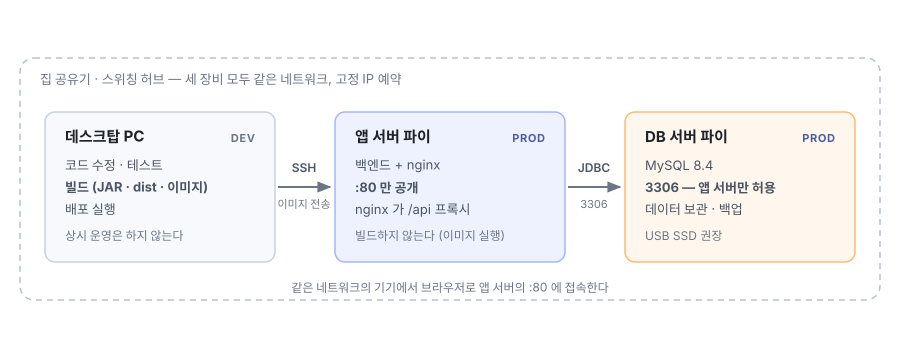
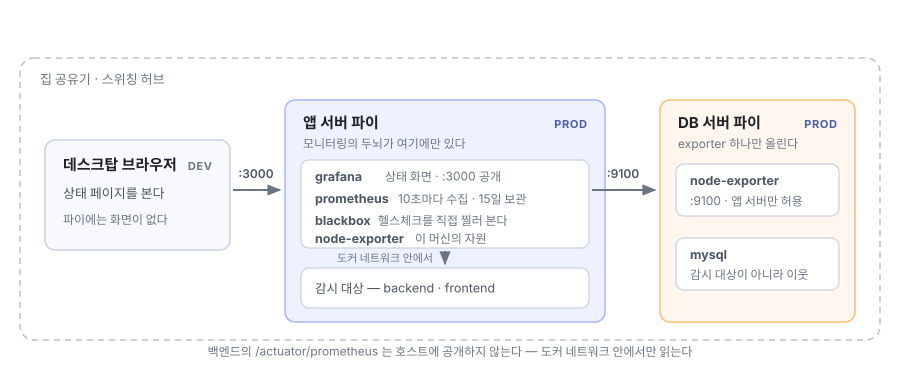

# 환경 구축과 배포 가이드

아무것도 없는 상태에서 **로컬 개발 환경을 만들고, 라즈베리파이에 배포해 운영하기까지**의
절차서다. 순서대로 따라가면 된다.

| 문서 | 역할 |
|---|---|
| 본 문서 | 환경 구축 → 배포 → 운영 절차 |
| [FEATURES.md](FEATURES.md) | 무엇을 할 수 있는가 (기능 안내) |
| [BEETLE_PRD.md](BEETLE_PRD.md) | 도메인 규칙의 정본 |
| [README.md](README.md) | 프로젝트 소개와 명령 요약 |

---

## 0. 전체 구성

### 무엇이 어디서 도는가



| 장비 | 하는 일 | 하지 않는 일 |
|---|---|---|
| 데스크탑 PC | 코드 수정, 테스트, **빌드**, 배포 실행 | 서비스 상시 운영 |
| 앱 서버 파이 | 백엔드·프론트엔드 실행 | **빌드** (받은 이미지만 실행) |
| DB 서버 파이 | MySQL 실행, 데이터 보관 | 애플리케이션 실행 |

**빌드는 데스크탑에서만 한다.** 파이에서 Gradle·Vite 를 돌리면 느리고 메모리를 많이 쓴다.
JAR 과 정적 파일은 아키텍처와 무관하므로 데스크탑에서 만든 산출물을 그대로 옮긴다(3.1절).

### 저장소의 구성 파일

| 파일 | 쓰이는 곳 |
|---|---|
| `docker-compose.yml` | 세 환경 공통. 포트를 노출하지 않는다 |
| `docker-compose.override.yml` | **로컬 개발** — 자동으로 함께 적용된다 |
| `docker-compose.prod.yml` | 배포 공통 — prod 프로필, 시드 미적용, 재시작 정책 |
| `docker-compose.app.yml` | 배포: 앱 서버 호스트 |
| `docker-compose.db.yml` | 배포: DB 서버 호스트 |
| `backend/Dockerfile` · `frontend/Dockerfile` | 로컬 개발용. 컨테이너 안에서 소스를 빌드한다 |
| `backend/Dockerfile.dist` · `frontend/Dockerfile.dist` | **배포용.** 미리 만든 산출물만 담는다 |
| `docker-compose.monitoring.yml` | 모니터링 — 앱 서버에 얹는다 (5부) |
| `docker-compose.db-monitoring.yml` | 모니터링 — DB 서버에 올리는 exporter (5부) |
| `monitoring/` | 프로메테우스·Grafana 설정과 대시보드 |
| `scripts/deploy.sh` | 데스크탑 → 앱 서버 배포 |

로컬은 명령이 짧고(`docker compose up -d`), 배포는 파일을 명시해야 한다. **실수로 빠뜨렸을
때 운영이 아니라 로컬로 뜨는 방향**이 안전하기 때문이다.

---

# 1부. 로컬 개발 환경 (데스크탑)

## 1.1 필요한 것 — Docker 하나

JDK·Node·MySQL 을 설치하지 않는다. 빌드가 모두 컨테이너 안에서 일어난다.

```bash
docker compose version   # v2 이상
```

Docker Desktop / Rancher Desktop / Colima / Docker Engine 아무거나 된다.

> 호스트에 JDK·Node 가 필요한 경우는 하나뿐이다. 백엔드를 IDE 로 띄우거나(JDK 17)
> 프론트엔드를 Vite 개발 서버로 띄울 때(Node 22)다. 1.6절에서 다룬다.

## 1.2 저장소 받기

```bash
git clone -b dev https://github.com/jinsub-kim-dev/Beetle.git
cd Beetle
```

개발은 `dev` 에서 이뤄지므로 로컬은 `dev` 를 받는다. `main` 은 검증이 끝난 상태만 머지하는
배포 기준 브랜치다.

## 1.3 `.env` — 지금은 만들지 않아도 된다

로컬 기본값이 코드에 있어 `.env` 없이 뜬다. 아래에 해당할 때만 만든다.

- 포트를 바꿔야 한다 (`FRONTEND_PORT` / `BACKEND_PORT` / `DB_PORT`)
- DB 계정·비밀번호를 바꿔야 한다 (`DB_NAME` / `DB_USER` / `DB_PASSWORD`)

```bash
cp .env.example .env
```

> **계정을 바꿀 거라면 첫 기동 전에 정한다.** MySQL 은 데이터 볼륨이 비어 있을 때만 계정을
> 만든다(1.5절). 나중에 `.env` 만 고쳐도 반영되지 않는다.

## 1.4 띄우기

```bash
docker compose up -d --build
```

`docker-compose.override.yml` 이 자동으로 적용되어 로컬 구성으로 뜬다. 이 한 줄이 아래를
순서대로 수행한다.

| 순서 | 내용 | 첫 실행 소요 |
|---|---|---|
| 1 | 백엔드 이미지 빌드 — 컨테이너 안에서 Gradle 이 의존성을 받고 `bootJar` 를 만든다 | 몇 분 |
| 2 | 프론트엔드 이미지 빌드 — `npm ci` 와 Vite 빌드, 결과를 nginx 이미지에 담는다 | 1~2분 |
| 3 | MySQL 기동과 최초 구성 (1.5절) | 30초 내외 |
| 4 | 백엔드 기동 — MySQL 헬스체크를 기다린 뒤 Flyway 마이그레이션 | 10초 내외 |
| 5 | 프론트엔드(nginx) 기동 | 즉시 |

두 번째부터는 레이어 캐시가 있어 훨씬 빠르다. 진행 상황은 `-d` 를 빼거나
`docker compose logs -f backend` 로 본다.

## 1.5 MySQL 최초 구성 — 자동이다

**`CREATE DATABASE` 나 `CREATE USER` 를 직접 실행하지 않는다.** 첫 기동 때 아래가
순서대로 일어난다.

| 단계 | 주체 | 내용 |
|---|---|---|
| 1 | MySQL 컨테이너 | `DB_NAME` 데이터베이스와 `DB_USER` 계정을 만들고 **그 DB 에만** 권한을 준다 |
| 2 | 같음 | 문자셋 `utf8mb4`, 정렬 `utf8mb4_unicode_ci`, 타임존 `+09:00` |
| 3 | 백엔드 (Flyway) | `db/migration` 의 스키마를 적용한다 |
| 4 | 백엔드 (Flyway) | **로컬에서만** `db/seed` 의 시드를 넣는다 (기본 카테고리 13종, 결제 수단 `현금`) |

확인 명령이다.

```bash
# DB·계정·권한
docker exec -e MYSQL_PWD=beetlepassword beetle-mysql \
  mysql -ubeetle -e "SHOW DATABASES; SHOW GRANTS FOR CURRENT_USER();"

# 마이그레이션 이력 (로컬은 시드까지 5건)
docker exec -e MYSQL_PWD=beetlepassword beetle-mysql \
  mysql -ubeetle beetle -e "SELECT version, description, success FROM flyway_schema_history;"
```

애플리케이션 계정에는 `GRANT ALL ON beetle.*` 만 있고 서버 전체 권한은 없다.

> **첫 기동 이후에는 계정 정보를 바꿀 수 없다.** MySQL 은 데이터 볼륨이 비어 있을 때만
> 초기화한다. 이미 데이터가 있으면 `MYSQL_USER`/`MYSQL_PASSWORD` 를 바꿔도 무시하므로,
> `.env` 만 고치면 백엔드가 `Access denied` 로 죽는다.
>
> - 데이터를 버려도 되면 `docker compose down -v` 후 다시 기동
> - 데이터를 지켜야 하면 4.2절로 백업한 뒤 볼륨을 지우고 복구하거나,
>   기존 계정으로 접속해 `ALTER USER 'beetle'@'%' IDENTIFIED BY '새 비밀번호';`

**스키마는 Flyway 로만 바꾼다.** 테이블을 손으로 만들지 않는다. Hibernate 가
`ddl-auto=validate` 로 매핑과 실제 스키마를 대조하므로 손으로 바꾼 스키마는 다음 기동에서
드러난다. 새 마이그레이션은
`backend/src/main/resources/db/migration/V<번호>__<설명>.sql` 로 추가한다.

## 1.6 확인

```bash
docker compose ps                                  # 세 서비스가 healthy
curl -fsS http://localhost:8080/actuator/health
curl -fsS http://localhost:8080/api/categories     # 시드 13건
```

브라우저에서 http://localhost:5173 을 연다. 왼쪽 위에 `LOCAL` 배지가 보이면 로컬 구성이다.

| 대상 | 주소 |
|---|---|
| 웹 화면 | http://localhost:5173 |
| 백엔드 API | http://localhost:8080 |
| API 문서 | http://localhost:8080/swagger-ui.html |
| MySQL | `localhost:13306` (`beetle` / `beetlepassword`) |

MySQL 만 표준 포트(3306)를 피한다. 호스트에 이미 MySQL 이 있는 환경에서 충돌하기 때문이며,
컨테이너 안쪽 포트는 3306 그대로다.

## 1.7 개발 중 쓰는 명령

**일부만 컨테이너로 띄우기** — 백엔드를 IDE 로 디버깅하거나 프론트엔드 HMR 이 필요할 때다.

```bash
# 백엔드를 Gradle 로 (JDK 17 필요)
docker compose up -d mysql
cd backend && ./gradlew bootRun          # 포트 변경: SERVER_PORT=18080 ./gradlew bootRun

# 프론트엔드를 Vite 개발 서버로 (Node 22 필요)
docker compose up -d mysql backend
cd frontend && npm install && npm run dev
```

백엔드는 프로필을 지정하지 않으면 dev 로 뜨고 `localhost:13306` 의 컨테이너 DB 에 붙는다.
Vite 는 `/api` 를 `http://localhost:8080` 으로 프록시한다. 백엔드 포트를 바꿨다면
`frontend/.env.development.local` 에 `VITE_API_PROXY_TARGET` 을 지정한다.
(`.env.development` 는 공용 기본값이므로 개인 설정은 `*.local` 에 둔다)

**검증** — 작업을 마치면 돌린다.

```bash
cd backend  && ./gradlew check   # 테스트 + 도메인 커버리지 + 규칙 강제
cd frontend && npm run check     # 타입 검사 + 린트 + 테스트
```

통합 테스트는 Testcontainers 로 실제 MySQL 을 띄우므로 Docker 가 켜져 있어야 한다.

**정리**

```bash
docker compose down      # 종료 (데이터 유지)
docker compose down -v   # 볼륨까지 삭제 — 1.5절의 최초 구성이 다시 일어난다
```

## 1.8 로컬에서 자주 겪는 문제

| 증상 | 원인과 해결 |
|---|---|
| 화면이 안 열리는데 `ps` 는 정상 | 그 포트를 다른 프로세스가 점유. `lsof -nP -iTCP:5173 -sTCP:LISTEN` 확인 후 `.env` 에서 포트 변경 |
| 점유 프로세스가 없는데도 접속 불가 | 컨테이너 생성 시 포트가 막혀 포트 전달이 붙지 못한 상태. `docker compose down && docker compose up -d` |
| `Access denied for user` | 첫 기동 이후 `.env` 의 계정을 바꿨다 (1.5절) |
| `Schema validation: missing table` | 마이그레이션 미적용. `flyway_schema_history` 확인. 스키마를 손으로 고쳤다면 `down -v` |
| 백엔드가 계속 재시작 | `docker compose logs backend` 를 먼저 본다. 대개 DB 접속 정보 문제다 |
| 첫 빌드가 아주 느리다 | 정상이다. Gradle 의존성을 처음 받는다 |

---

# 2부. 배포 환경 준비 (파이 2대)

## 2.1 하드웨어와 OS

| 항목 | 요구 | 이유 |
|---|---|---|
| OS 아키텍처 | **64-bit(arm64) 필수** | `mysql:8.4` 공식 이미지는 amd64 와 arm64 만 제공한다. 32-bit(armv7) 에서는 DB 서버가 아예 뜨지 않는다 |
| 모델 | Pi 4 또는 5 | |
| RAM | 2GB 가능 · 4GB 권장 | 실측 사용량: 앱 서버 약 420MB(백엔드 416 + nginx 3), DB 서버 약 490MB |
| DB 서버 저장장치 | **USB SSD 권장** | MySQL + SD 카드는 쓰기 증폭으로 수명이 빨리 줄고 랜덤 쓰기가 느리다. 이 구성에서 가장 중요한 하드웨어 선택이다 |

```bash
uname -m     # aarch64 여야 한다. armv7l 이면 64-bit OS 로 다시 설치한다
free -h
df -h /
```

이미지의 아키텍처 지원은 아래와 같다(직접 조회한 값이다).

| 이미지 | 지원 플랫폼 |
|---|---|
| `mysql:8.4` | `linux/amd64`, `linux/arm64/v8` |
| `eclipse-temurin:17-jre` | amd64, arm/v7, arm64/v8, ppc64le, s390x |
| `nginx:alpine` | 386, amd64, arm/v6, arm/v7, arm64/v8, ppc64le, riscv64, s390x |

## 2.2 네트워크

**고정 IP 는 공유기에서 DHCP 예약으로** 잡는 것을 권한다. 파이에서 static 설정을 하는 것보다
관리 지점이 한 곳으로 모이고, 파이를 재설치해도 유지된다.

앱 서버는 DB 서버의 주소를 설정 파일에 적어 두므로 **DB 서버의 IP 고정은 필수**다.

예시로 아래 주소를 쓴다. 실제 값으로 바꿔 읽으면 된다.

| 장비 | 주소 |
|---|---|
| 앱 서버 파이 | `192.168.0.10` |
| DB 서버 파이 | `192.168.0.20` |

**호스트명**도 구분해 둔다. 두 대를 SSH 로 오갈 때 헷갈리지 않는다.

```bash
sudo hostnamectl set-hostname beetle-app     # DB 서버는 beetle-db
```

## 2.3 두 대에 공통으로 하는 설정

**① 시간대와 시간 동기**

```bash
sudo timedatectl set-timezone Asia/Seoul
timedatectl status        # NTP service: active 확인
```

두 파이의 시계가 어긋나면 **소비일·청구일이 하루 틀어진다.** 이 가계부에서는 특히 중요하다.

**② SSH 키 인증**

```bash
# 데스크탑에서
ssh-copy-id pi@192.168.0.10
ssh-copy-id pi@192.168.0.20
```

```bash
# 각 파이에서 — 비밀번호 로그인 차단
sudo sed -i 's/^#\?PasswordAuthentication.*/PasswordAuthentication no/' /etc/ssh/sshd_config
sudo systemctl restart ssh
```

기본 `pi` 계정 대신 개인 계정을 쓰는 편이 낫다. SSH 포트 변경은 LAN 전용이면 필요하지 않다.
배포 스크립트가 SSH 를 쓰므로 **키 인증은 반드시** 설정한다.

**③ Docker 설치와 자동 시작**

```bash
curl -fsSL https://get.docker.com | sh     # Docker 공식 설치 스크립트
sudo usermod -aG docker "$USER"            # 재로그인 후 적용
sudo systemctl enable --now docker
docker compose version
docker info | grep -i "no memory limit" && echo "cgroup 메모리 설정이 필요하다"
```

> 마지막 줄이 걸리면 `/boot/firmware/cmdline.txt`(구버전은 `/boot/cmdline.txt`) 맨 뒤에
> `cgroup_enable=memory cgroup_memory=1` 을 한 줄에 이어 붙이고 재부팅한다.

**④ 방화벽** — LAN 안이라도 필요한 포트만 연다.

```bash
sudo apt install -y ufw
sudo ufw allow 22/tcp
sudo ufw enable
```

```bash
# 앱 서버에서 — 웹
sudo ufw allow 80/tcp
```

```bash
# DB 서버에서 — 앱 서버 IP 만 허용
sudo ufw allow from 192.168.0.10 to any port 3306 proto tcp
```

**⑤ 보안 업데이트**

```bash
sudo apt install -y unattended-upgrades
sudo dpkg-reconfigure -plow unattended-upgrades
```

DB 서버는 자동 재부팅을 켜지 않는 편이 안전하다. 재부팅 시점은 사람이 정한다.

> **로그 용량은 저장소에서 이미 제한해 두었다.** compose 의 모든 서비스가 `json-file`
> 드라이버에 `max-size=10m, max-file=3` 으로 묶여 있다. 제한이 없으면 SD 카드가 조용히
> 가득 차는 사고가 난다.

## 2.4 DB 서버 파이 (`192.168.0.20`)

**① 저장소와 `.env`**

```bash
git clone https://github.com/jinsub-kim-dev/Beetle.git
cd Beetle
cp .env.example .env
chmod 600 .env
```

```bash
# .env — DB 서버
MYSQL_ROOT_PASSWORD=<직접 생성한 값>
DB_NAME=beetle
DB_USER=beetle
DB_PASSWORD=<직접 생성한 값>

DB_PORT=3306          # 앱 서버가 접속할 포트
# DB_BIND=0.0.0.0     # 특정 인터페이스에만 열려면 그 주소
```

> **비밀번호는 첫 기동 때 확정된다**(1.5절). 처음부터 실제로 쓸 값을 넣는다.
> `DB_NAME`·`DB_USER`·`DB_PASSWORD` 는 **앱 서버의 `.env` 와 같아야 한다.**
> `MYSQL_ROOT_PASSWORD` 는 이 호스트에만 둔다.

**② 기동** — MySQL 만 뜬다.

```bash
docker compose -f docker-compose.yml -f docker-compose.prod.yml -f docker-compose.db.yml up -d
docker compose -f docker-compose.yml -f docker-compose.prod.yml -f docker-compose.db.yml ps
```

`mysql:8.4` 는 파이가 Docker Hub 에서 직접 받는다(arm64 지원). 전송할 것이 없다.

**③ 확인**

```bash
# DB 서버에서
source .env
docker exec -e MYSQL_PWD="$DB_PASSWORD" beetle-mysql mysql -u"$DB_USER" -e "SHOW DATABASES;"
```

```bash
# 앱 서버에서 — 접속 경로가 열렸는지
nc -vz 192.168.0.20 3306
```

스키마는 아직 비어 있다. **앱 서버의 백엔드가 처음 뜰 때 Flyway 가 만든다.** 배포 환경은
시드를 적용하지 않으므로 빈 가계부로 시작한다.

## 2.5 앱 서버 파이 (`192.168.0.10`)

**① 저장소와 `.env`**

```bash
git clone https://github.com/jinsub-kim-dev/Beetle.git
cd Beetle
cp .env.example .env
chmod 600 .env
```

```bash
# .env — 앱 서버
DB_NAME=beetle
DB_USER=beetle
DB_PASSWORD=<DB 서버와 동일한 값>

DB_HOST=192.168.0.20      # DB 서버 주소
DB_PORT_TARGET=3306       # DB 서버가 노출한 포트

FRONTEND_PORT=80
```

루트 비밀번호는 필요하지 않다. 이 호스트는 MySQL 을 띄우지 않는다.

**② 여기서 `up` 을 하지 않는다.** 이미지를 받기 전에 기동하면 파이가 소스를 빌드하려 든다.
첫 기동은 데스크탑에서 배포 스크립트로 한다(3부).

---

# 3부. 배포 (데스크탑에서)

## 3.1 왜 파이에서 빌드하지 않는가

**JAR 과 `dist` 는 아키텍처와 무관하다.** JVM 바이트코드와 정적 파일이기 때문이다. 그래서
데스크탑에서 네이티브로 빌드한 산출물을 arm64 이미지에 **담기만** 하면 된다. `Dockerfile.dist`
에는 `RUN` 이 없으므로 크로스 빌드에 에뮬레이션이 필요하지 않다.

| 방식 | arm64 이미지 생성 시간 |
|---|---|
| `Dockerfile.dist` — 산출물 COPY | **백엔드 1.4초 · 프론트엔드 0.3초** (실측) |
| `Dockerfile` — 컨테이너 안에서 Gradle·Vite | 데스크탑이 x86 이면 QEMU 에뮬레이션으로 수십 분 |

데스크탑의 CPU 가 x86 이든 ARM 이든 결과가 같다.

## 3.2 배포

```bash
APP_HOST=pi@192.168.0.10 ./scripts/deploy.sh
```

스크립트가 순서대로 수행한다.

| 순서 | 내용 |
|---|---|
| 1 | SSH 접속·buildx 확인, 커밋되지 않은 변경 경고 |
| 2 | `./gradlew bootJar` — 백엔드 JAR |
| 3 | `npm ci && npm run build` — 프론트엔드 `dist` |
| 4 | `Dockerfile.dist` 로 arm64 이미지 두 개 (태그는 git 짧은 해시) |
| 5 | `docker save \| gzip \| ssh 'docker load'` — 약 190MB |
| 6 | 원격 `.env` 에 `TAG` 기록 후 `compose up -d` |
| 7 | `/actuator/health` 확인 |

| 이름 | 기본값 | 설명 |
|---|---|---|
| `APP_HOST` | (필수) | 앱 서버 SSH 대상 |
| `REMOTE_DIR` | `~/Beetle` | 원격 저장소 경로 |
| `TAG` | git 짧은 해시 | 이미지 태그. 원격 `.env` 에 남아 어떤 버전이 떠 있는지 알 수 있다 |
| `PLATFORM` | `linux/arm64` | 대상 아키텍처 |
| `--skip-build` | | 빌드를 건너뛰고 기존 산출물로 이미지만 만든다 |
| `--no-restart` | | 이미지만 옮기고 원격 재기동은 하지 않는다 |

## 3.3 확인

```bash
# 앱 서버에서
docker compose -f docker-compose.yml -f docker-compose.prod.yml -f docker-compose.app.yml ps
curl -fsS http://localhost/actuator/health     # {"groups":[...],"status":"UP"}
curl -fsS http://localhost/api/categories      # 첫 배포 직후에는 []

docker compose -f docker-compose.yml -f docker-compose.prod.yml -f docker-compose.app.yml \
  logs backend | grep -E "profile is active|Database:"
```

- 프로필이 `prod` 이고 `Database:` 줄이 **DB 서버 주소**를 가리켜야 한다
- 세 컨테이너 모두 `(healthy)` 여야 한다
- 다른 기기에서 `http://192.168.0.10` 으로 접속한다
- 외부에 열리는 것은 앱 서버의 80 하나뿐이다. 백엔드 포트는 노출하지 않고 nginx 가
  `/api` 를 프록시한다

배포 환경에서는 아래가 **404** 여야 정상이다. 스펙과 내부 구조를 드러낼 이유가 없다.

```bash
curl -o /dev/null -w '%{http_code}\n' http://192.168.0.10/swagger-ui.html   # 404
curl -o /dev/null -w '%{http_code}\n' http://192.168.0.10/v3/api-docs       # 404
curl -o /dev/null -w '%{http_code}\n' http://192.168.0.10/actuator/env      # 404
```

## 3.4 스크립트 없이 배포하기

스크립트가 하는 일을 손으로 하면 이렇다. 문제가 생겼을 때 어느 단계인지 가리기 좋다.

```bash
# 데스크탑
cd backend && ./gradlew bootJar && cd ..
cd frontend && npm run build && cd ..

TAG=$(git rev-parse --short HEAD)
docker buildx build --platform linux/arm64 -f backend/Dockerfile.dist  -t beetle-backend:$TAG  --load ./backend
docker buildx build --platform linux/arm64 -f frontend/Dockerfile.dist -t beetle-frontend:$TAG --load ./frontend

docker save beetle-backend:$TAG beetle-frontend:$TAG | gzip -1 \
  | ssh pi@192.168.0.10 'gunzip | docker load'
```

```bash
# 앱 서버 — .env 의 TAG 를 방금 만든 태그로 맞춘 뒤
docker compose -f docker-compose.yml -f docker-compose.prod.yml -f docker-compose.app.yml up -d
```

> 배포가 잦아지면 데스크탑에 로컬 레지스트리(`registry:2`)를 두고 파이가 `pull` 하는
> 방식으로 바꿀 수 있다. 바뀐 레이어만 전송되고 명령이 짧아진다. 지금 방식은 추가 인프라가
> 필요 없는 대신 매번 전체 이미지를 보낸다.

---

# 4부. 운영

## 4.1 재배포

```bash
# 데스크탑에서
git pull origin main        # 또는 작업 브랜치
APP_HOST=pi@192.168.0.10 ./scripts/deploy.sh
```

- **파이에서 `git pull` 만 해도 반영되지 않는다.** 이미지가 바뀌어야 한다
- 컨테이너가 교체되는 몇 초 동안 화면이 끊긴다. 백엔드는 진행 중인 요청을 마치고 종료한다
- 새 마이그레이션이 있으면 백엔드가 뜰 때 자동 적용된다. **마이그레이션은 되돌릴 수 없으므로
  스키마를 바꾸는 배포 전에는 4.2절로 백업한다**

## 4.2 백업과 복구

데이터는 DB 서버의 Docker Volume 에 있다. 컨테이너를 지워도 남지만 `down -v` 나 저장장치
고장에는 함께 사라진다. **DB 서버에서 정기 백업을 돌린다.**

```bash
# DB 서버에서 — 백업
cd ~/Beetle && source .env
docker exec -e MYSQL_PWD="$DB_PASSWORD" beetle-mysql \
  mysqldump -u"$DB_USER" --single-transaction --no-tablespaces "$DB_NAME" \
  > "beetle-$(date +%Y%m%d).sql"
```

```bash
# DB 서버에서 — 복구
cd ~/Beetle && source .env
docker exec -i -e MYSQL_PWD="$DB_PASSWORD" beetle-mysql \
  mysql -u"$DB_USER" "$DB_NAME" < beetle-20260911.sql
```

- `--single-transaction` 은 쓰기를 막지 않으면서 일관된 시점을 뜬다
- `--no-tablespaces` 가 없으면 `PROCESS privilege` 경고가 난다. 애플리케이션 계정에는 그
  권한이 없고 필요하지도 않다
- 비밀번호에 공백이나 `$` 가 있으면 `.env` 에서 따옴표로 감싼다(`source` 로 읽기 때문)
- cron 에 걸고 **덤프를 파이 밖으로 옮긴다.** 같은 저장장치에 두면 고장 시 함께 사라진다

자동화는 스크립트로 두는 편이 안전하다. cron 한 줄에 몰아넣으면 `%` 이스케이프와 따옴표
때문에 조용히 실패하기 쉽다.

```bash
# DB 서버에서
mkdir -p ~/backup
cat > ~/backup-beetle.sh <<'EOF'
#!/usr/bin/env bash
set -euo pipefail
cd "$HOME/Beetle"
set -a; . ./.env; set +a

STAMP="$(date +%Y%m%d)"
TMP="$HOME/backup/.beetle-$STAMP.part"
# 중간에 실패해도 조각 파일을 남기지 않는다
trap 'rm -f "$TMP"' EXIT

docker exec -e MYSQL_PWD="$DB_PASSWORD" beetle-mysql \
  mysqldump -u"$DB_USER" --single-transaction --no-tablespaces "$DB_NAME" > "$TMP"

# 실패한 덤프가 백업처럼 남지 않게 내용을 확인한 뒤에만 확정한다
if [ ! -s "$TMP" ] || ! grep -q "Dump completed" "$TMP"; then
  echo "백업이 불완전합니다. 기존 백업은 건드리지 않습니다." >&2
  exit 1
fi

gzip -c "$TMP" > "$HOME/backup/beetle-$STAMP.sql.gz"
find "$HOME/backup" -name 'beetle-*.sql.gz' -mtime +14 -delete
echo "백업 완료: beetle-$STAMP.sql.gz"
EOF
chmod +x ~/backup-beetle.sh

~/backup-beetle.sh && ls -la ~/backup      # 먼저 손으로 돌려 확인한다
```

임시 파일에 받아 **`Dump completed` 가 있는지 확인한 뒤에만** 확정한다. 그러지 않으면
접속 실패로 만들어진 0바이트 파일이 백업처럼 남아, 정작 복구할 때 발견된다.

```bash
crontab -e
# 매일 03:30
30 3 * * * /home/pi/backup-beetle.sh >> /home/pi/backup/backup.log 2>&1
```

덤프는 **파이 밖으로 옮긴다.** 데스크탑에서 주기적으로 당겨오는 것이 간단하다.

```bash
# 데스크탑에서
rsync -av pi@192.168.0.20:~/backup/ ~/beetle-backup/
```

## 4.3 로그와 상태

명령이 길어 불편하면 각 파이의 `.env` 에 아래 한 줄을 넣는다. 그 호스트에서는 `-f` 를
생략할 수 있다. **배포 전용 호스트에서만** 쓴다.

```bash
# 앱 서버
COMPOSE_FILE=docker-compose.yml:docker-compose.prod.yml:docker-compose.app.yml
# DB 서버
COMPOSE_FILE=docker-compose.yml:docker-compose.prod.yml:docker-compose.db.yml
```

```bash
docker compose logs -f backend        # 실시간
docker compose logs --tail 100 backend
docker compose ps                     # 상태
docker compose restart backend
docker compose down                   # 종료 (데이터 유지)
```

배포 프로필의 로그 수준은 `INFO` 이고 SQL 을 남기지 않는다. 오류 응답에도 예외 메시지와
스택을 담지 않고 `code`/`message` 만 노출한다.

파이 특유의 상태도 함께 본다.

```bash
vcgencmd measure_temp       # 온도
vcgencmd get_throttled      # 0x0 이 정상. 스로틀링 여부
df -h /                     # 저장장치 여유
free -h
```

## 4.4 자동 시작과 재부팅

배포 구성의 모든 서비스가 `restart: unless-stopped` 이므로, Docker 서비스가 부팅 시 켜져
있으면(2.3절 ③) 파이를 재부팅해도 알아서 올라온다. 헬스체크가 붙어 있어 프로세스가 죽으면
다시 살아난다.

**DB 서버를 먼저 켠다.** 앱 서버가 먼저 떠서 DB 에 붙지 못하면 기동에 실패하고, 재시작
정책이 재시도하는 동안 잠시 접속되지 않는다.

## 4.5 되돌리기

```bash
# 데스크탑에서 — 이전 커밋으로 다시 배포
git checkout <이전 커밋>
APP_HOST=pi@192.168.0.10 ./scripts/deploy.sh
```

이전에 배포한 이미지가 파이에 남아 있으면 태그만 바꿔도 된다.

```bash
# 앱 서버에서
docker images | grep beetle           # 남아 있는 태그 확인
sed -i 's/^TAG=.*/TAG=<이전 태그>/' .env
docker compose up -d
```

애플리케이션은 이렇게 돌아가지만 **DB 마이그레이션은 되돌아가지 않는다.** 스키마가 이미
바뀐 상태라면 이전 버전이 뜨지 않을 수 있다(Hibernate 가 `validate` 로 검증한다). 그 경우
4.2절의 백업으로 DB 를 함께 복구한다.

---

# 5부. 모니터링 — 상태 페이지

파이 2대의 상태와 자원, 그리고 백엔드·프론트엔드가 살아 있는지를 한 화면에서 본다.

## 5.1 무엇이 어디서 도는가



**모니터링의 두뇌는 앱 서버 파이에만 올린다.** DB 서버 파이에는 자기 자원을 내보내는
`node-exporter` 하나만 둔다. 파이마다 화면을 띄우는 것이 아니라, 앱 서버의 Grafana
한 곳에서 두 대를 같이 본다.

| 컨테이너 | 어디에 | 하는 일 |
|---|---|---|
| `grafana` | 앱 서버 | 상태 화면. 브라우저로 여는 곳 |
| `prometheus` | 앱 서버 | 10초마다 지표를 모아 보관한다 |
| `blackbox` | 앱 서버 | 백엔드·프론트엔드에 실제로 HTTP 요청을 보내 살아 있는지 본다 |
| `node-exporter` | **양쪽 파이** | 그 머신의 CPU·메모리·디스크·온도를 내보낸다 |

수집 주기는 10초다(`monitoring/prometheus.yml` 의 `scrape_interval`). 더 짧게 하면 파이의
수집 부하와 SD 카드 쓰기가 빠르게 늘어난다. 보관 기간은 15일, 용량 상한은 2GB 이며 둘 중
먼저 닿는 쪽이 적용된다.

백엔드 지표(JVM 힙·HTTP 요청·DB 커넥션 풀)는 `/actuator/prometheus` 에서 온다. 이 경로는
**호스트에 공개되지 않는다.** 같은 도커 네트워크 안의 프로메테우스만 읽고, nginx 는
`/actuator/health` 만 통과시키고 나머지 `/actuator/*` 는 404 로 막는다.

## 5.2 DB 서버 파이에 올리기

앱 서버의 프로메테우스가 긁을 포트를 연다.

```bash
# DB 서버에서
cd ~/Beetle
docker compose -f docker-compose.db-monitoring.yml -p beetle-monitoring up -d
```

프로젝트 이름(`-p`)을 따로 주는 이유: 이 호스트의 MySQL 은 다른 compose 파일로 떠 있으므로,
모니터링만 따로 올리고 따로 내릴 수 있게 분리한다.

**방화벽으로 앱 서버만 허용한다.** 열어 두면 같은 네트워크의 다른 기기가 이 머신의 자원
정보를 읽을 수 있다.

```bash
# DB 서버에서
sudo ufw allow from 192.168.0.10 to any port 9100 proto tcp
```

확인한다.

```bash
# 앱 서버에서
curl -s http://192.168.0.20:9100/metrics | head -3
```

## 5.3 앱 서버 파이에 올리기

`.env` 에 DB 서버의 주소를 적는다.

```bash
# .env — 앱 서버 (기존 값에 아래를 추가)
DB_NODE_IP=192.168.0.20
GRAFANA_PORT=3000
GRAFANA_ANONYMOUS=true
GRAFANA_ADMIN_PASSWORD=<바꿀 비밀번호>
```

`DB_NODE_IP` 는 **IP 로 적어야 한다.** 프로메테우스는 설정 파일에서 환경 변수를 펼치지
않으므로, compose 가 이 값을 `db-node` 라는 별명에 붙여 주고 `monitoring/prometheus.yml` 은
그 별명만 본다. 값이 없으면 `127.0.0.1` 을 보게 되어 "DB 서버 머신" 이 중단으로 표시된다.

파일을 하나 더 얹어 띄운다. **앱과 같은 compose 프로젝트여야 한다.** 그래야 프로메테우스가
도커 네트워크 안쪽에서 `backend:8080` 을 직접 긁을 수 있다.

```bash
# 앱 서버에서
docker compose -f docker-compose.yml -f docker-compose.prod.yml \
               -f docker-compose.app.yml -f docker-compose.monitoring.yml up -d
```

`.env` 에 `COMPOSE_FILE` 을 쓰고 있다면(4.3절) 그 줄 끝에 `:docker-compose.monitoring.yml`
을 붙이고 `docker compose up -d` 만 실행한다.

브라우저에서 `http://192.168.0.10:3000` 을 연다. 로그인 없이 `Beetle 상태` 대시보드가
첫 화면으로 열린다.

## 5.4 화면 읽는 법

| 영역 | 보여 주는 것 |
|---|---|
| 상태 (카드 4개) | 앱 서버 머신 · DB 서버 머신 · 백엔드 · 프론트엔드. 초록 `정상`, 빨강 `중단`/`장애` |
| 최근 이력 | 시간대별 상태를 칸으로 나열한다. 언제 끊겼는지 되짚는 곳 |
| 머신 자원 | 두 파이의 CPU·메모리 사용률, 메모리 사용량, 디스크 여유, CPU 온도 |
| 애플리케이션 | JVM 힙, 초당 HTTP 요청(상태 코드별), DB 커넥션 풀 |

판정 기준은 서비스마다 다르다.

- **머신** — 그 머신의 `node-exporter` 가 응답하는지. 머신이 꺼지거나 네트워크가 끊기면 중단
- **백엔드** — `/actuator/health` 가 200 이고 종합 상태가 `UP` 인지. **200 만으로 보지 않는다.**
  DB 연결을 잃으면 응답은 오지만 상태가 `DOWN` 이 되고, 그 경우 장애로 잡는다
- **프론트엔드** — nginx 가 `index.html` 을 내려주는지

`CPU 온도` 는 온도 센서가 있는 환경에서만 나온다. 라즈베리파이에서는 보이고, 도커 데스크톱의
가상 머신에서는 비어 있다. 80도를 넘으면 스로틀링이 걸려 성능이 떨어진다
(`vcgencmd get_throttled` 로도 확인할 수 있다, 4.3절).

## 5.5 로컬에서 확인하기

배포 전에 데스크탑에서 같은 화면을 띄워 볼 수 있다.

```bash
docker compose -f docker-compose.yml -f docker-compose.override.yml \
               -f docker-compose.monitoring.yml up -d
```

`http://localhost:3000` 을 연다. **"DB 서버 머신" 은 중단으로 보이는 것이 정상이다.**
로컬에는 머신이 하나뿐이다.

## 5.6 알림은 없다

현재 구성은 **보는 것만 한다.** 서비스가 멈춰도 알려 주지 않으므로 화면을 열어 봐야 안다.
알림이 필요해지면 두 방향이 있다.

- Grafana 의 알림 기능을 켠다. `monitoring/grafana/provisioning/alerting/` 에 규칙 파일을
  두면 프로비저닝된다 (지금은 비어 있다)
- Uptime Kuma 를 따로 올린다. 화면에서 클릭으로 감시 대상과 알림 채널을 붙일 수 있어
  설정이 더 짧다

## 5.7 자원 사용량

모니터링 컨테이너 4개를 합쳐 대략 200~300MB 를 쓴다. 앱 서버 파이의 메모리가 4GB 라면
백엔드(약 420MB)와 함께 올려도 여유가 있다. 프로메테우스의 데이터는 도커 볼륨
(`beetle-prometheus-data`)에 쌓이고 2GB 를 넘지 않는다.

```bash
docker stats --no-stream
```

---

# 6부. 공개하기 전에 — 인증이 없다

이 시스템은 **"프라이빗 가계부"** 전제로 만들어졌다.

- **인증이 없다.** 단일 사용자를 가정해 로그인을 구현하지 않았다. 주소를 아는 누구나 읽고
  쓰고 지울 수 있다
- **HTTPS 가 없다.** nginx 는 80 포트로 평문 제공한다
- **상태 화면도 열려 있다.** 모니터링을 올렸다면 `:3000` 이 로그인 없이 열린다
  (`GRAFANA_ANONYMOUS=true`). 머신 자원과 요청량이 그대로 보이므로, 밖에서 접근할 수 있게
  만들 거라면 `false` 로 두고 `GRAFANA_ADMIN_PASSWORD` 를 바꾼다

집 안에서만 쓸 것이면 공유기의 포트 포워딩을 **열지 않는 것**으로 충분하다. 밖에서 써야
하면 아래 중 하나를 먼저 갖춘다.

- VPN (공유기의 OpenVPN/WireGuard, Tailscale 등)
- Cloudflare Tunnel + Access — 포트를 열지 않고 인증까지 붙는다
- 앞단에 인증과 TLS 를 붙인 리버스 프록시 (Caddy + basic auth, nginx + oauth2-proxy)

---

# 7부. 배포 환경에서 겪는 문제

| 증상 | 원인과 해결 |
|---|---|
| MySQL 이 `exec format error` 로 죽는다 | 32-bit OS 다. `uname -m` 이 `armv7l` 이면 64-bit OS 로 다시 설치한다 (2.1절) |
| 백엔드가 `Communications link failure` 로 재시작 반복 | DB 서버에 닿지 못한다. `nc -vz <DB IP> 3306`, ufw 규칙, `.env` 의 `DB_HOST`/`DB_PORT_TARGET` 확인 |
| 백엔드가 `Access denied for user` | 두 파이의 `.env` 계정이 다르거나, DB 서버 계정이 첫 기동 때 다른 값으로 만들어졌다 (1.5절) |
| 파이가 소스를 빌드하려 든다 | 이미지를 받지 않고 `up` 을 했다. `.env` 의 `TAG` 가 적재한 이미지 태그와 같은지 확인한다 (`docker images \| grep beetle`) |
| `required variable ... is missing` | 그 호스트의 `.env` 에 필수 값이 없다. 부록 A 참고 |
| 배포 스크립트가 SSH 에서 멈춘다 | 키 인증이 설정되지 않았다 (2.3절 ②). `ssh -o BatchMode=yes pi@<주소> true` 로 확인한다 |
| 앱 서버가 느리거나 멈춘다 | `free -h` 로 메모리 확인. 파이에서 빌드하지 않았는지도 본다 |
| DB 서버가 느리다 | SD 카드의 임의 쓰기 성능 문제일 수 있다. USB SSD 로 옮기는 것이 가장 효과가 크다 |
| 소비일·청구일이 하루씩 어긋난다 | 두 파이의 시간대와 NTP 동기 확인 (2.3절 ①) |
| 재부팅 후 안 올라온다 | `sudo systemctl enable docker` 확인 |
| 온도가 높거나 성능이 떨어진다 | `vcgencmd get_throttled` 가 `0x0` 이 아니면 전원·냉각을 점검한다 |
| 상태 화면의 "DB 서버 머신" 이 계속 중단이다 | 앱 서버 `.env` 의 `DB_NODE_IP` 가 없거나 틀렸다. **호스트 이름이 아니라 IP 여야 한다** (5.3절). DB 서버의 ufw 가 9100 을 막고 있는지도 본다 |
| 상태 화면에 애플리케이션 패널만 비어 있다 | 모니터링을 앱과 **다른 compose 프로젝트**로 띄웠다. 같은 프로젝트여야 `backend:8080` 에 닿는다 (5.3절) |
| 상태 화면의 `CPU 온도` 가 비어 있다 | 온도 센서가 없는 환경이다. 라즈베리파이에서는 나온다 (5.4절) |

---

# 부록 A. 환경 변수

`.env` 는 **호스트마다 다르다.** 아래는 어디에 무엇이 필요한지의 전체 목록이다.

| 변수 | 로컬 | 앱 서버 | DB 서버 | 기본값 | 설명 |
|---|:---:|:---:|:---:|---|---|
| `DB_NAME` | 선택 | **필수** | **필수** | `beetle` | 데이터베이스 이름 |
| `DB_USER` | 선택 | **필수** | **필수** | `beetle` | 애플리케이션 계정 |
| `DB_PASSWORD` | 선택 | **필수** | **필수** | `beetlepassword` | 두 파이가 같아야 한다 |
| `MYSQL_ROOT_PASSWORD` | 선택 | — | **필수** | `rootpassword` | DB 가 뜨는 호스트에만 둔다 |
| `DB_HOST` | — | **필수** | — | `mysql` | DB 서버 주소 |
| `DB_PORT_TARGET` | — | **필수** | — | `3306` | DB 서버가 노출한 포트 |
| `DB_PORT` | 선택 | — | 선택 | 로컬 `13306` · 배포 `3306` | 호스트에 노출할 DB 포트 |
| `DB_BIND` | — | — | 선택 | `0.0.0.0` | DB 포트를 특정 인터페이스에만 열 때 |
| `FRONTEND_PORT` | 선택 | 선택 | — | 로컬 `5173` · 배포 `80` | 웹 공개 포트 |
| `BACKEND_PORT` | 선택 | — | — | `8080` | 로컬에서만 노출한다 |
| `TAG` | — | **배포 시 자동** | — | `latest` | 이미지 태그. `deploy.sh` 가 기록한다 |
| `DB_POOL_SIZE` | — | 선택 | — | 로컬 `10` · 배포 `20` | 커넥션 풀 크기 |
| `COMPOSE_FILE` | — | 선택 | 선택 | — | `-f` 생략용 (4.3절) |
| `SPRING_PROFILES_ACTIVE` | 선택 | 고정 `prod` | 고정 `prod` | `dev` | 배포 파일이 고정한다 |
| `FRONTEND_BUILD_MODE` | 선택 | — | — | 로컬 `development` | 로컬 이미지 빌드 모드 |
| `GRAFANA_PORT` | 선택 | 선택 | — | `3000` | 상태 화면 포트 (5부) |
| `GRAFANA_ANONYMOUS` | 선택 | 선택 | — | `true` | 로그인 없이 상태 화면 열기 |
| `GRAFANA_ADMIN_PASSWORD` | 선택 | 선택 | — | `admin` | 상태 화면 관리자 비밀번호 |
| `DB_NODE_IP` | — | 선택 | — | `127.0.0.1` | DB 서버 파이의 **IP**. 없으면 DB 서버가 중단으로 보인다 |
| `NODE_EXPORTER_PORT` | — | — | 선택 | `9100` | 앱 서버가 긁을 포트 |
| `NODE_EXPORTER_BIND` | — | — | 선택 | `0.0.0.0` | 그 포트를 특정 인터페이스에만 열 때 |

프론트엔드 빌드 시점 변수(`VITE_*`)는 `frontend/.env.development` 와
`frontend/.env.production` 에 있고 커밋된다. 브라우저로 그대로 내려가므로 **비밀 값을 넣지
않는다.**

# 부록 B. 명령 요약

```bash
# 로컬 (데스크탑)
docker compose up -d --build     # 기동
docker compose down              # 종료
docker compose down -v           # 데이터까지 초기화
cd backend && ./gradlew check    # 백엔드 검증
cd frontend && npm run check     # 프론트엔드 검증

# 배포 (데스크탑에서)
APP_HOST=pi@192.168.0.10 ./scripts/deploy.sh

# 앱 서버 파이
docker compose -f docker-compose.yml -f docker-compose.prod.yml -f docker-compose.app.yml up -d
docker compose -f docker-compose.yml -f docker-compose.prod.yml -f docker-compose.app.yml ps

# DB 서버 파이
docker compose -f docker-compose.yml -f docker-compose.prod.yml -f docker-compose.db.yml up -d

# 모니터링 (5부) — 앱 서버 파이: 파일을 하나 더 얹는다
docker compose -f docker-compose.yml -f docker-compose.prod.yml \
               -f docker-compose.app.yml -f docker-compose.monitoring.yml up -d

# 모니터링 — DB 서버 파이: exporter 만
docker compose -f docker-compose.db-monitoring.yml -p beetle-monitoring up -d
```
